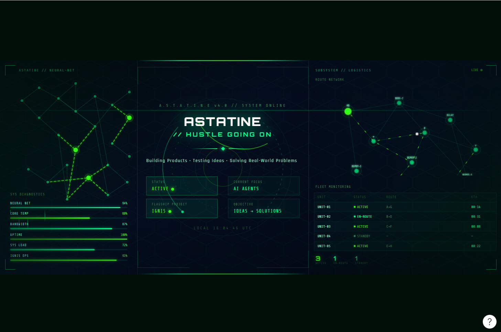

<h1 align="center">GAGAN ASTATINE</h1>

<p align="center">
  
</p>

<p align="center">
  
</p>

---

# SYSTEM INITIALIZATION

Hello, I'm Gagan.

I build products that solve real-world problems through software, automation, and artificial intelligence.

Current Interests:

- AI Agents
- Hackathons
- Startup Building
- Automation Systems

---

# CURRENT STATUS

| MODULE | STATUS |
|----------|----------|
| System | Active |
| Learning | In Progress |
| AI Agents | Exploring |
| Startups | Building |
| Hackathons | Participating |

---

# CURRENT OBJECTIVE

```text
PROBLEMS → SOLUTIONS

Build First
Learn Continuously
Improve Relentlessly
```

---

# FLAGSHIP PROJECT

## IGNIS

AI Logistics Command Center

IGNIS aims to transform fragmented logistics operations into intelligent decision-making systems.

Core Modules:

- Route Intelligence
- Driver Analytics
- Fleet Monitoring
- Predictive Operations
- AI Decision Support

Status:

ACTIVE DEVELOPMENT

---

# TECH ARSENAL

## Frontend


## Backend


## Database


## AI


## Deployment


---

# ANALYTICS

<p align="center">
  
</p>

<p align="center">
  
</p>

<p align="center">
  
</p>

---

# ACTIVITY GRAPH

<p align="center">
  
</p>

---

# CONTACT PROTOCOL

Email

```text
astatinegagan@gmail.com
```

LinkedIn

```text
https://www.linkedin.com/in/gaganastatine
```

---

<p align="center">

SYSTEM STATUS : ACTIVE

Building Products • Testing Ideas • Solving Real-World Problems

</p>
